# 🎬 Movies App (Flutter)

A Responsive Flutter-based movies application supporting **English and Arabic**, with login and register , onboarding, and rich movie browsing features.

  

---

## 📹 App Demo: How Movies App Works
- watch this video:

https://www.loom.com/share/a4a8296fe7db4c3195e02fe6a6b7b532?sid=6b837b11-bcbe-403b-81ed-e43327c5d9a5

---

## 🚀 Features

- 👋 Onboarding flow for new users
- 🔐 login and register  
- 🌍 English and Arabic language support 
- 🏠 Bottom navigation with:
  - Home
  - Search
  - Explore Categories
  - Profile
- 💾 Save movies to "Watch Later"
- 📜 View watch history
- 🔍 Search movies by name
- 👤 View and edit user profile:
  - Name, image, and phone number
  - Change password
  - Delete account
- 🚪 Logout functionality

---
## 📸 Screenshots

### 🟦 Onboarding

  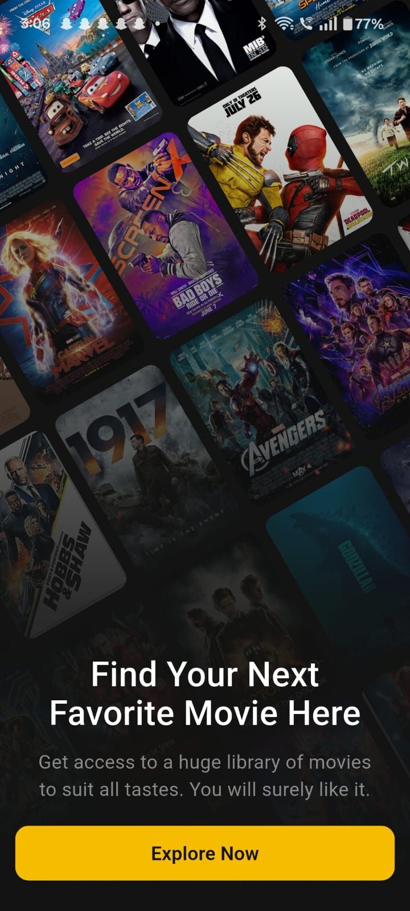
  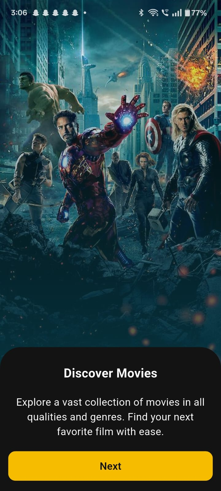
  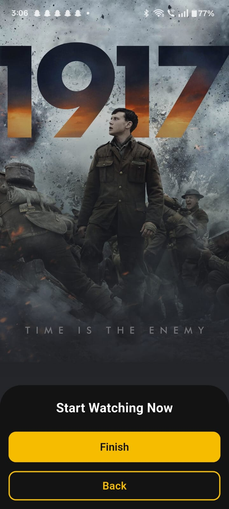

### 🔐 Authentication

  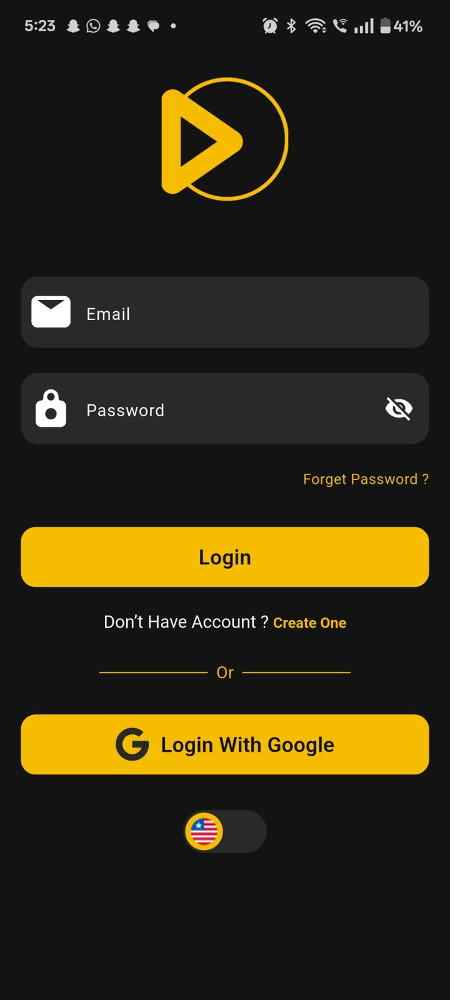
  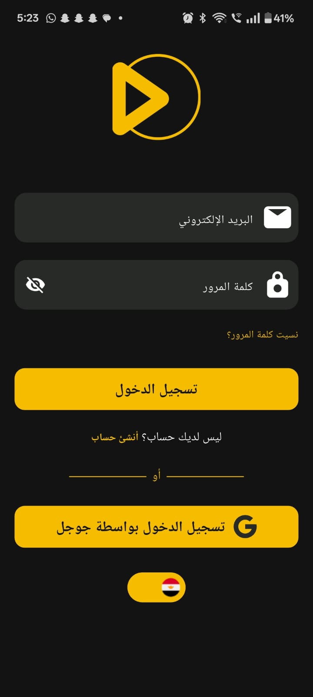
  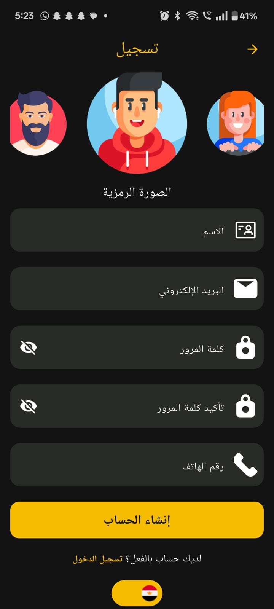
  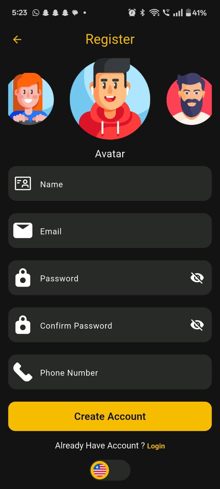

### 🏠 Home Tab

  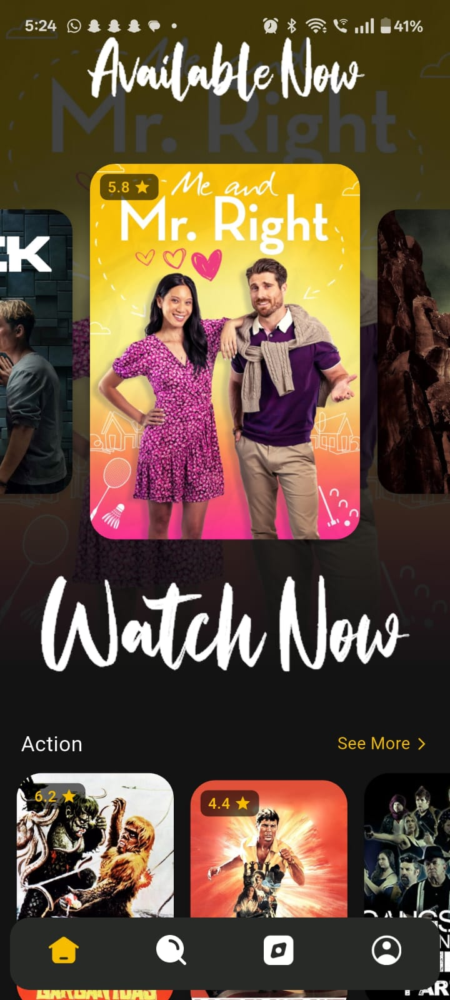
  

### 🎬 Movie Details

  
  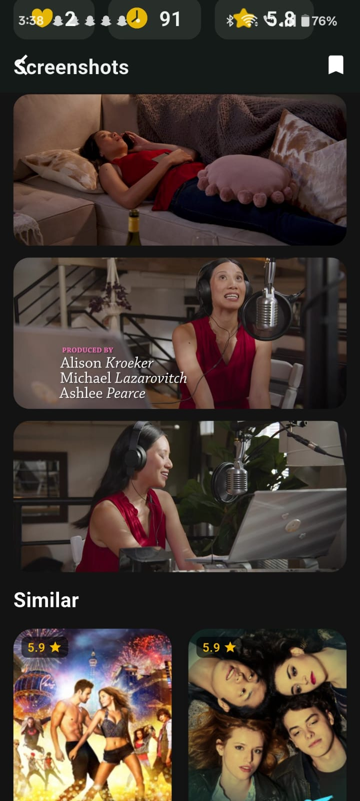
  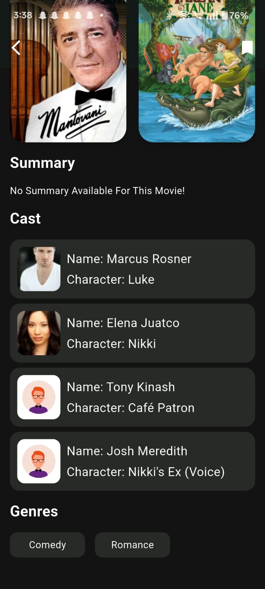
  

### 🔍 Search

  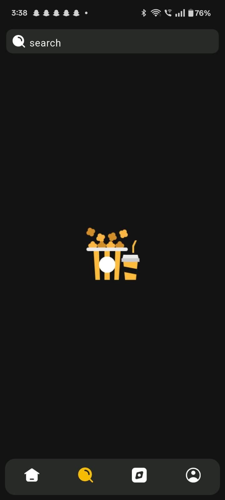
  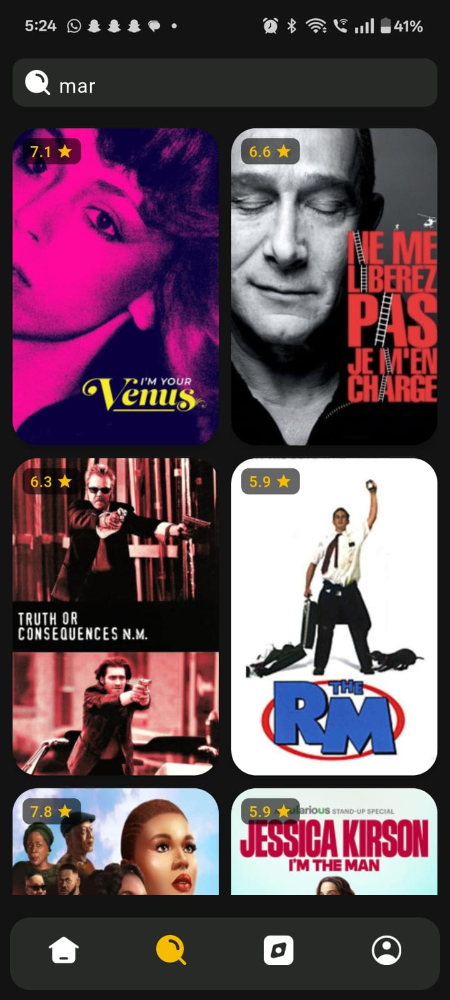

### 🗂️ Explore

  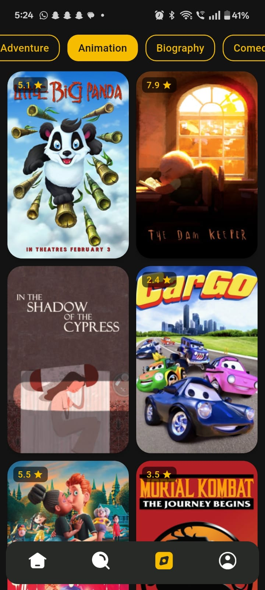

### 👤 Profile Overview

  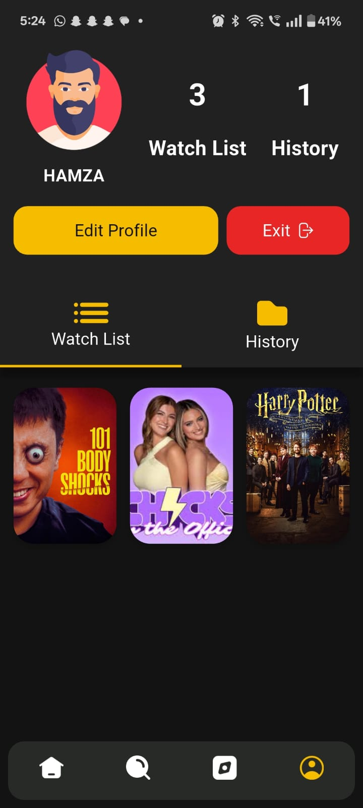
  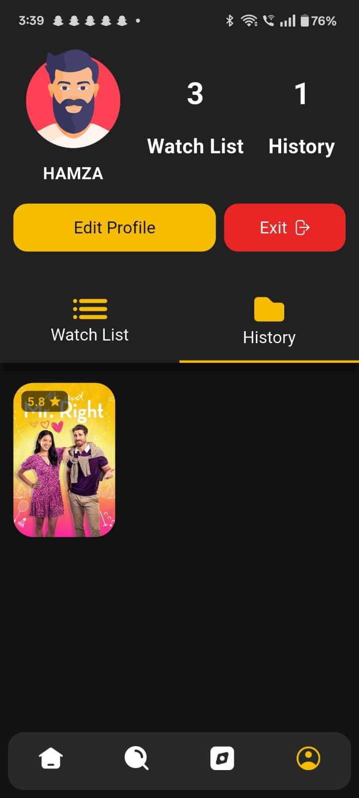
  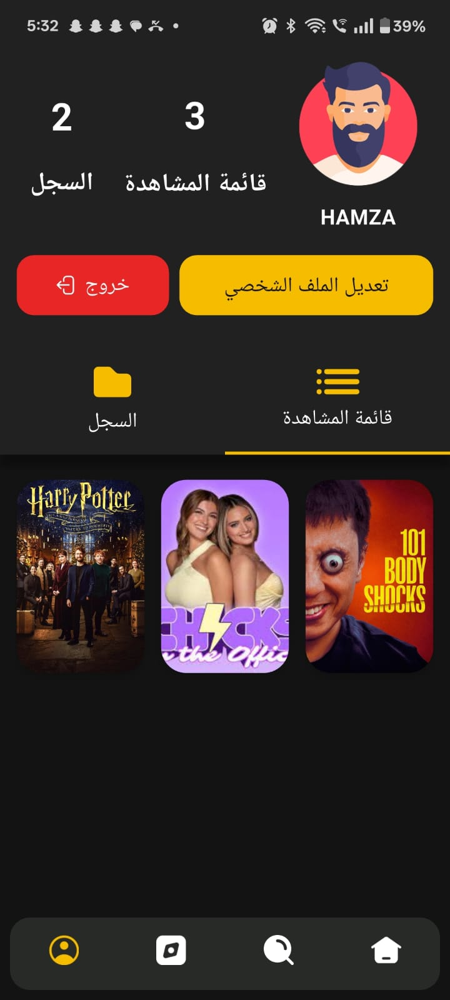

### ✏️ Edit Profile

  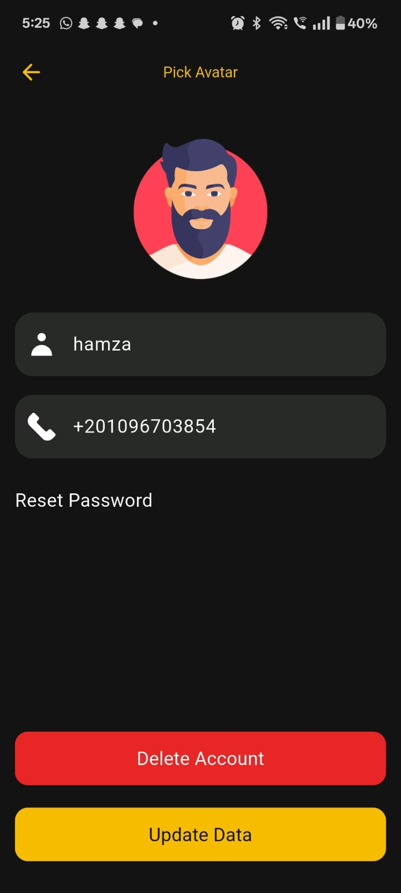
  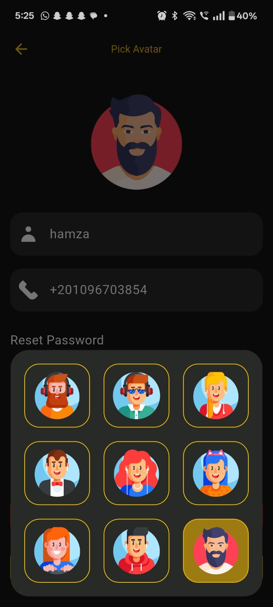

### 🔑 Reset Password

  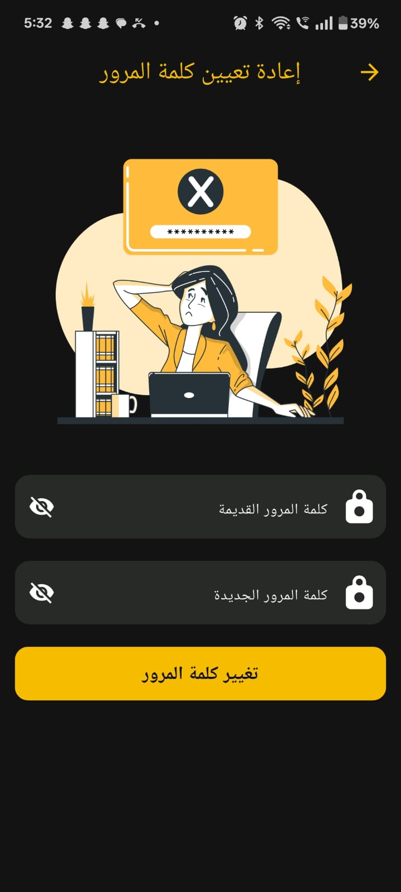
    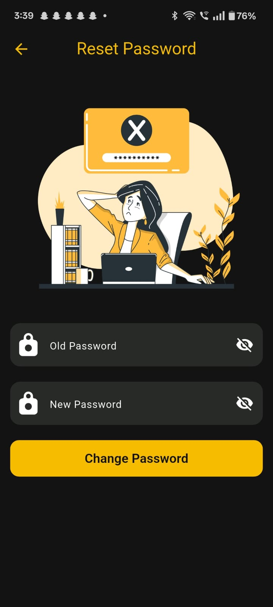

## 🧩 Tech Stack

- Flutter & Dart
- HTTP REST API
- Flutter localization (`intl`)
- Flutter ScreenUtil for responsiveness

---
